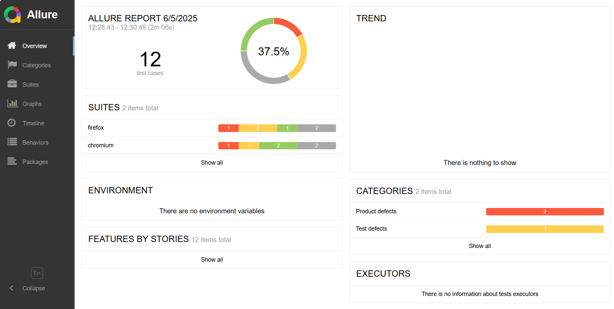

# GEN-AI 🤖 Test Automation Framework

[](https://github.com/enableedge/playwright-typescript-enableedge)
[](https://github.com/enableedge/playwright-typescript-enableedge/issues)
[](https://github.com/microsoft/playwright-mcp)


A comprehensive test automation framework built with TypeScript and Playwright for automating the web UI and API test cases. !
Test cases can be generated / created using GenAI🤖 tools (Playwright MCP server 🎭 integrated with VS code and Github Co-Pilot) based on manual test cases

## Description

This repository contains a sample repository for UI and API automation using TypeScript and Playwright. The framework follows the Page Object Model (POM) design pattern and supports both UI and API testing.
Framework also support generating automated test cases based on manual test case steps using GenAI 🤖, through  🎭 Playwright MCP server, VS code and Github Co-pilot.

## Getting Started

These instructions will help you set up and run the test framework on your local machine.

### Prerequisites

- Node.js (v14 or higher)
- Java (v11 or higher for Allure Report)

### Installation

1. Clone the repository:
```bash
git clone https://github.com/enableedge/playwright-typescript-enableedge.git
cd playwright-typescript-enableedge
```

2. Install dependencies:
```bash
npm install
```

3. Install Playwright browsers:
```bash
npx playwright install
```

### Running the Tests

To run all UI tests:
```bash
npm run test:ui
```

To run all API tests:
```bash
npm run test:api
```

To run specific test files:
```bash
npm run test -- <path-to-test-file>
```




### Setting up Playwright MCP 🎭

[Playwright MCP](https://github.com/microsoft/playwright-mcp) (Model Context Protocol) enables AI-assisted test generation and maintenance within VS Code.

1. Install the Playwright extension for VS Code:
[](https://marketplace.visualstudio.com/items?itemName=ms-playwright.playwright)
```bash
code --install-extension ms-playwright.playwright
```

2. Enable Playwright MCP in VS Code settings:
   - Open VS Code settings (File > Preferences > Settings)
   - Search for "Playwright MCP"
   - Check "Enable Playwright MCP Server"
   - Or add this to your settings.json:
```json
{
    "playwright.mcp.enabled": true
}
```

3. Start using Playwright MCP:
   - Open VS Code's Command Palette (CMD+Shift+P / Ctrl+Shift+P)
   - Type "Playwright: Start MCP Server" and select it
   - Check the Output panel (CMD+Shift+U / Ctrl+Shift+U) and select "Playwright MCP" from the dropdown
   - You should see logs indicating the MCP server has started

4. Generate tests:
   - With MCP running, you can use natural language to describe test scenarios e.g. [Sample manual test case ](https://github.com/enableedge/playwright-typescript-enableedge/blob/main/docs/mcp-ai/sample%20test%20case%20prompt%20to%20llm.txt) 
   - MCP will automate the browser and generate corresponding Playwright test code [Code generated as per above test case](https://github.com/enableedge/playwright-typescript-enableedge/blob/main/tests/ui/order_placement.spec.ts)
   - The generated tests will use modern Playwright practices and locators

Tips:
- Keep the Output panel open to monitor MCP's actions
- MCP generates tests based on actual browser interactions
- The generated tests are saved in your project's test directory
- You can modify the generated tests as needed

## 🎬 Demo Video
Watch the live demonstration of GenAI based Playwright testing in action:

[](/docs/mcp-ai/MCP_Playwright_recording_no_mic.mp4)
**📺 [Watch Demo Video](https://github.com/enableedge/playwright-typescript-enableedge/blob/main/docs/mcp-ai/MCP_Playwright_recording_no_mic.mp4)** - See how to write and execute tests using natural language with Playwright MCP and GitHub Copilot.


### Built With
- [Playwright MCP](https://github.com/microsoft/playwright-mcp) - MCP server for playwrite
- [TypeScript](https://www.typescriptlang.org/) - Programming language
- [Playwright](https://playwright.dev/) - Test automation framework
- [Allure Report](https://docs.qameta.io/allure/) - Test reporting tool
- [Page Object Model](https://martinfowler.com/bliki/PageObject.html) - Design pattern

### License

This project is licensed under the MIT License - see the LICENSE file for details.
